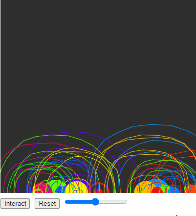
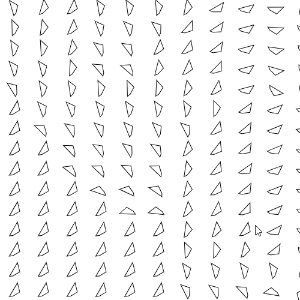
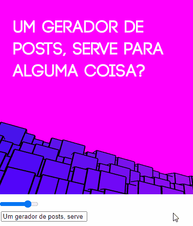

# Summary
Here are some of my most recent work on creative coding:

[[Run](https://rodjuncode.github.io/daft-pulse/)][[Code](https://github.com/rodjuncode/daft-pulse)]

***

[[Run](https://rodjuncode.github.io/flow-field-following-mouse/)][[Code](https://github.com/rodjuncode/flow-field-following-mouse)]

***

[[Run](https://rodjuncode.github.io/100-formas-de-contar-de-1-a-100/)][[Code](https://github.com/rodjuncode/100-formas-de-contar-de-1-a-100/)]

***

[[Run](https://github.com/rodjuncode/maestro/)][[Code](https://rodjuncode.github.io/maestro/)]

***

[[Run](https://rodjuncode.github.io/moebius-post-generator/)][[Code](https://github.com/rodjuncode/moebius-post-generator)]

***
